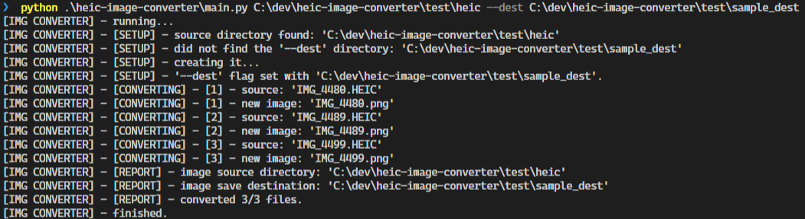
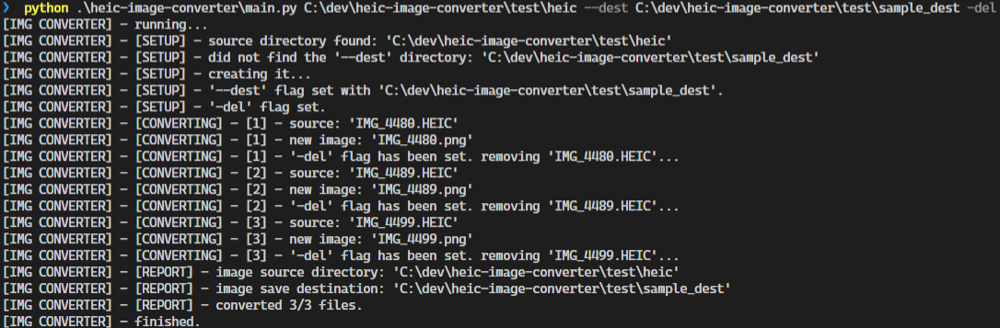

# Convert those Pesky `.HEIC` Images to Something More Useful!

i-Device images often come in `.heic` image file format, but these don't translate well to other uses...

I had a bunch of downloaded `.heic` files but wanted to convert them to `.png` or `.jpg` format so I wrote this converter!

## Notes

- no suitable package was found to convert `.heic` ➡️ `.jpg` on Windows.
- panoramic or stretched images may not convert properly.

## Usage

1. ***Install required packages***
   1. `pip install pillow_heif`
   2. `pip install pillow` (or use default `PIL` - legacy)
   3. see [requirements.txt](./requirements.txt)
2. ***Download the repo*** [**`.zip`**](https://github.com/XDwightsBeetsX/image-converter/archive/refs/heads/master.zip)
3. Obtain the ***path to the python `main.py` program***
4. Obtain the ***path to the `.heic` image folder***
5. Use desired [flags](#flags)

## Examples

- Set the Destination folder

    

- Automatically delete converted files

    

## Flags

- double-hyphen '`--`' flags take arguments
- single-hyphen '`-`' flags are booleans

| Flag      | Options            | Description |
|  :-:      | :--                | :--         |
| `--to`    | `png`              | sets the desired type to convert the `.heic` files to. |
| `--dest`  | `path/to/saveDest` | choose the save location for the converted files. |
| `-del`    | `none`             | delete the original `.heic` file after successful conversions. |

> *if you have comments / suggestions / bug fixes, please make a github issue [here](https://github.com/XDwightsBeetsX/heic-image-converter/issues)*
> 
> *thanks for checking this project out :)*
